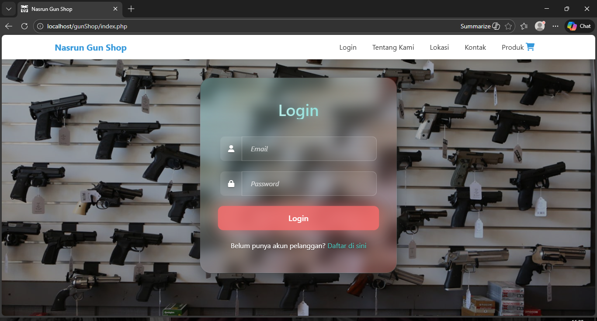
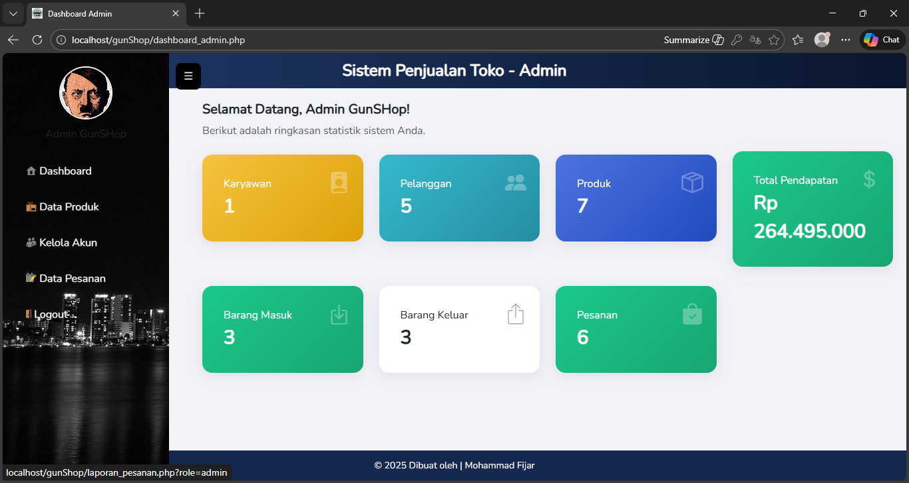
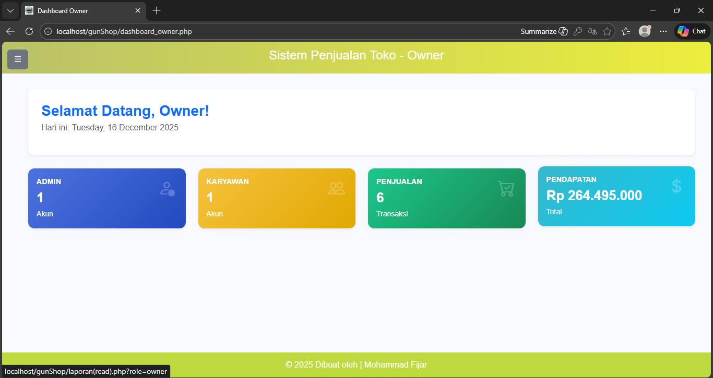
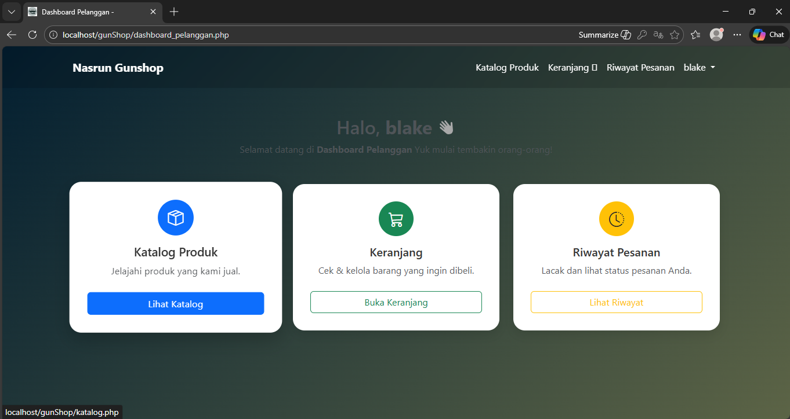
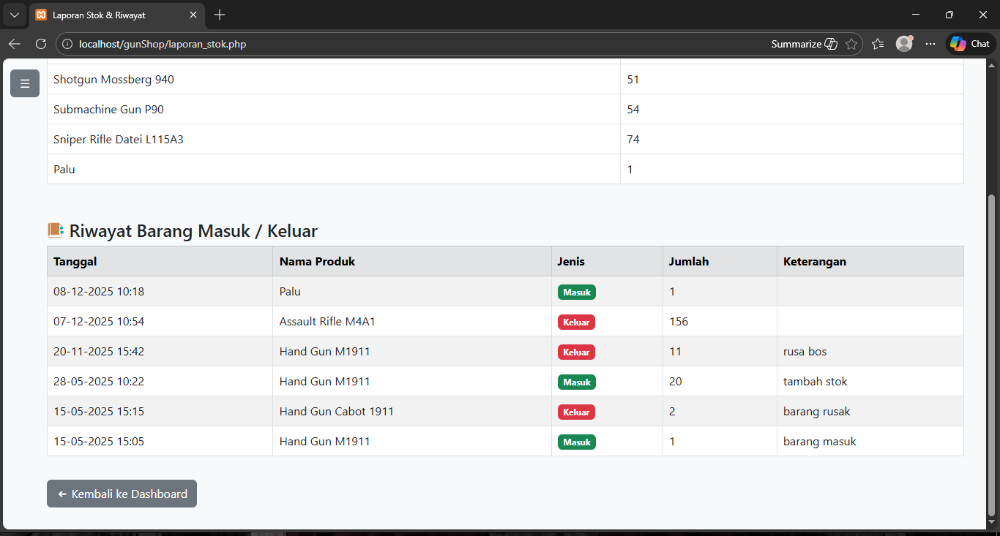

---

# 🛒🔫 GunShop Management System

GunShop Management System adalah aplikasi berbasis web yang dirancang untuk mengelola proses penjualan dan manajemen stok pada sebuah gun shop. Sistem ini menerapkan konsep multi-role user untuk membedakan hak akses dan tanggung jawab setiap pengguna, sehingga pengelolaan data menjadi lebih terstruktur, aman, dan transparan.

---

## 🎯 Tujuan Sistem
Sistem ini dibuat untuk:
- Mempermudah pengelolaan produk dan stok barang
- Meningkatkan transparansi data stok kepada owner
- Mempercepat proses pemesanan dan transaksi pelanggan
- Mengatur hak akses pengguna berdasarkan peran (role)

---

## 👥 Role Pengguna

## 🛠️ Admin  

Admin memiliki hak akses penuh terhadap sistem, meliputi:
- Mengakses dashboard admin
- Menambah, mengubah, dan menghapus data produk (CRUD)
- Mengelola akun pengguna dan mengatur role
- Mencetak laporan transaksi dan stok dalam format PDF
- Mengelola dan memperbarui status pesanan

---

## 👁️ Owner  

Owner memiliki hak akses **read-only**, dengan fitur:
- Melihat data produk dan laporan transaksi
- Memantau perubahan stok barang secara otomatis
- Melihat riwayat barang masuk dan keluar
- Mendukung transparansi data tanpa dapat mengubah sistem

---

## 🔧 Karyawan  

Karyawan memiliki hak akses **update-only**, meliputi:
- Memperbarui stok barang
- Mengubah status pesanan pelanggan
- Mendukung operasional harian toko

---

## 🧑‍💻 Pelanggan  

Pelanggan dapat menggunakan sistem untuk:
- Melakukan registrasi dan login
- Melihat dan memilih produk
- Menambahkan produk ke keranjang
- Melakukan checkout
- Mengunggah bukti pembayaran
- Menunggu konfirmasi pesanan dari admin atau karyawan

---

## 🛠️ Teknologi yang Digunakan
- PHP Native
- MySQL
- HTML, CSS, JavaScript
- Bootstrap
- Font Awesome
- Library PDF

---

## 🔐 Keamanan Sistem
- Autentikasi login berbasis role
- Pembatasan akses halaman sesuai hak pengguna
- Validasi input data

---

##  📁 Struktur Folder
Lihat dokumentasi struktur folder pada repository ini untuk memahami pembagian modul berdasarkan role.

---

## 📄 Catatan
Project ini dibuat oleh Mohammad Fijar Septa Dendy untuk keperluan pembelajaran dan tugas pemrograman.

Sistem ini menerapkan konsep Role Based Access Control (RBAC) untuk membedakan hak akses pengguna sehingga proses manajemen data menjadi lebih terkontrol dan transparan.
---
